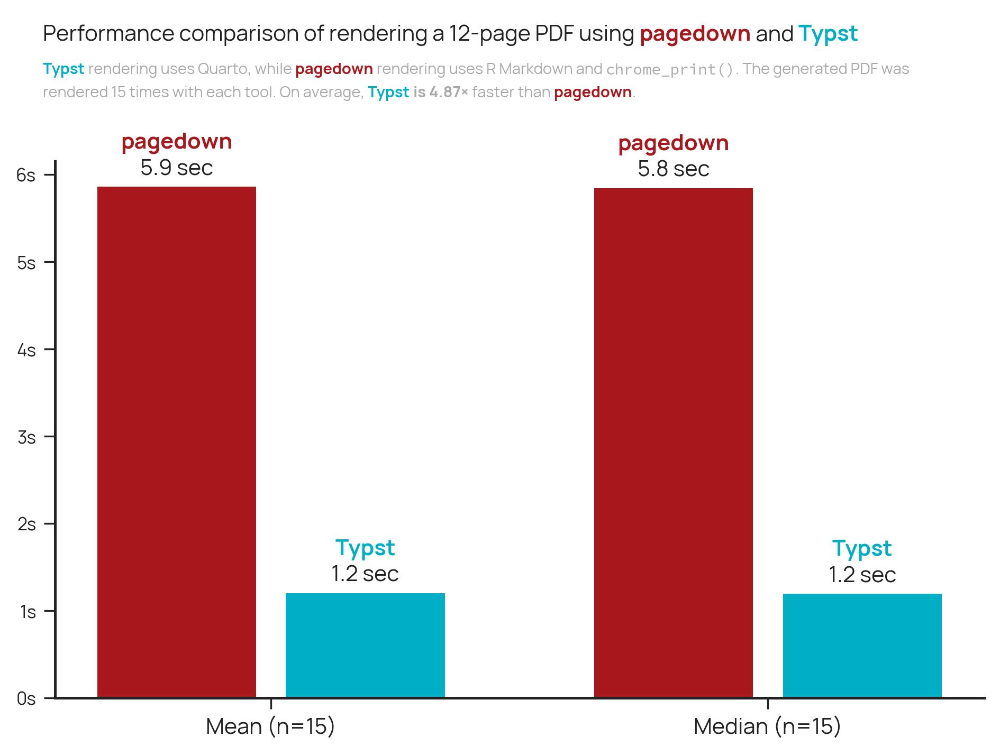

# Benchmark of Typst VS pagedown



This repository benchmarks rendering the same annual-report style document with two PDF pipelines:

- `pagedown`, via `pagedown::chrome_print()`
- Quarto + Typst, via `Quarto`

The benchmark writes timing data to TSV files and then uses `chart.py` to generate the comparison figure.

## Requirements

Install the command-line tools used by the benchmark:

- `uv`
- `just`
- `Rscript`
- `pagedown` for R
- Quarto
- Pandoc
- Google Chrome

The render scripts currently expect Chrome at:

```sh
/Applications/Google Chrome.app/Contents/MacOS/Google Chrome
```

If Chrome is elsewhere, update the `CHROME` value in `justfile` and `bench.sh`.

Install the Python dependencies with:

```sh
uv sync
```

Install the R package if needed:

```sh
Rscript -e 'install.packages("pagedown")'
```

Check that the required tools are visible:

```sh
just doctor
```

## Reproduce the Results

Run the full benchmark:

```sh
just benchmark
```

By default this performs 15 timed renders for each pipeline. It first renders both PDFs once, then writes:

- `output/bench-pagedown.tsv`
- `output/bench-typst.tsv`
- `output/pagedown.pdf`
- `output/typst.pdf`

It also prints a small summary table with the mean, median, minimum, maximum, and standard deviation for each renderer.

To use a different number of runs:

```sh
just runs=5 benchmark
```

Generate the chart from the benchmark TSV files:

```sh
uv run python chart.py
```

This writes:

```sh
output.png
```

## Useful Commands

Render both PDFs without benchmarking:

```sh
just render
```

Render only one pipeline:

```sh
just render-pagedown
just render-typst
```

Remove generated output:

```sh
just clean
```

Absolute timings depend on the local machine, installed versions, and system load, so compare the two pipelines from the same benchmark run.
