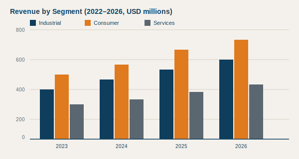

# Letter from the CEO {-}

::: lead
To our shareholders, customers, and colleagues,
:::

Fiscal year 2026 was a year of disciplined execution against an ambitious
strategy. We grew revenue across all three operating segments, expanded
operating margin by 140 basis points, and returned a record amount of
capital to shareholders while continuing to invest in research, talent,
and resilience.

Our results reflect choices we made years ago: to focus the portfolio,
to industrialise our software platform, and to build the kind of supply
chain that performs as well in turbulence as it does in calm waters.
Those choices are now compounding. They are also what gives us the
confidence to enter 2027 with a sharper set of priorities and a higher
bar for what "good" looks like.

I want to thank every employee of Acme Industries for the work behind
these numbers. Reports are written in spreadsheets, but companies are
built in conversations, hand-offs, and the small acts of care that
never make a press release.

::: signoff
**Margaret Chen** \
Chair & Chief Executive Officer
:::

# Executive summary {-}

Acme Industries delivered another year of broad-based growth in fiscal
2026. Total revenue reached **USD 2.41 billion**, up 11.3% year over
year, with double-digit growth in our Industrial and Consumer segments
and a return to growth in Services after two years of portfolio
rationalisation.

Operating margin expanded to **18.7%**, a 140 basis point improvement
driven by mix, pricing discipline, and structural cost actions
completed in the first half of the year. Free cash flow conversion
remained above 95% of net income.

We deployed capital across three priorities: organic investment in
R&D and capacity, bolt-on acquisitions in adjacent categories, and
direct returns to shareholders via dividends and buybacks. We exited
the year with **USD 612 million** in net cash and an undrawn revolving
credit facility, leaving us well positioned to act on opportunity.

Looking ahead, we expect revenue growth in the high single digits and
continued margin expansion, supported by the platform investments
described in this report.

::: callout
**Highlights at a glance**

- Revenue up 11.3% to USD 2.41B
- Operating margin 18.7% (+140 bps)
- Free cash flow USD 423M (96% conversion)
- Dividend raised for the 14th consecutive year
- Two bolt-on acquisitions closed in H2
:::

# 1. Company overview

Acme Industries is a diversified industrial and consumer technology
company headquartered in Pittsburgh, Pennsylvania. Founded in 1962 as
a precision components supplier, the company today operates three
reporting segments across more than 40 countries.

## Our segments

The **Industrial** segment supplies motion-control, sensing, and
fluid-handling components to original equipment manufacturers in the
aerospace, defence, medical-device, and automation sectors. It is our
largest segment by revenue and has historically generated the highest
operating margins.

The **Consumer** segment designs and markets a portfolio of premium
home and workshop products under the Acme, Vance, and Northrise brands.
It has been the fastest-growing segment over the past three years,
benefiting from the integration of the Vance acquisition completed in
fiscal 2024.

The **Services** segment provides field engineering, calibration, and
managed maintenance contracts, primarily to customers of the Industrial
segment. After two years of portfolio pruning, Services returned to
modest growth in 2026 and now operates at structurally higher margins.

## Where we operate

We employ approximately **11,400 people** across 26 manufacturing
sites, 4 R&D centres, and a network of regional service hubs. North
America remains our largest end market at 54% of revenue, followed by
EMEA at 28% and Asia-Pacific at 18%. Asia-Pacific has been the fastest
growing region for three consecutive years.

# 2. Financial highlights

The table below summarises selected income statement and cash flow
measures for the past three fiscal years. All figures are in millions
of US dollars unless otherwise noted.

::: kpi
| Measure                     |   FY2024 |   FY2025 |   FY2026 |
|:----------------------------|---------:|---------:|---------:|
| Revenue                     |  1,914.0 |  2,166.5 |  2,411.2 |
| Gross profit                |    788.7 |    906.5 |  1,036.8 |
| Gross margin                |    41.2% |    41.8% |    43.0% |
| Operating income            |    317.7 |    374.8 |    451.0 |
| Operating margin            |    16.6% |    17.3% |    18.7% |
| Net income                  |    236.1 |    282.5 |    341.2 |
| Free cash flow              |    219.4 |    267.9 |    323.0 |
| Diluted EPS (USD)           |     2.51 |     3.04 |     3.71 |
| Dividends per share (USD)   |     0.92 |     1.04 |     1.18 |
:::

## Revenue by segment

Revenue growth in 2026 was broad-based, with all three segments
contributing. Industrial benefited from continued strength in
aerospace and a recovery in factory automation orders. Consumer
posted another year of double-digit growth, helped by category
expansion and successful new product launches under the Vance brand.
Services returned to growth as the portfolio-pruning programme
concluded in the first half.

{.figure}

## Capital allocation

We returned **USD 287 million** to shareholders during the year, split
between dividends (USD 108M) and share repurchases (USD 179M).
Capital expenditure rose to USD 142M as we completed the expansion of
our Querétaro and Wrocław facilities and broke ground on a new R&D
campus near Pittsburgh.

# 3. Operational performance

Operationally, fiscal 2026 was defined by three themes: throughput,
quality, and energy. We exited the year with our highest plant
throughput on record, a 22% year-over-year reduction in field defects,
and energy intensity per unit of output 8% below the 2025 baseline.

## Throughput and quality

Our continuous improvement programme, *One Acme Operating System*,
entered its third full year of deployment. Sites at advanced maturity
levels delivered overall equipment effectiveness above 82%, well
above the industrial benchmark. We continue to roll the programme out
to recently acquired sites and expect to complete the first wave by
the end of fiscal 2027.

## Resilience

We expanded dual-sourcing on 38 additional critical components during
the year and qualified two new suppliers in geographies where we had
previously been single-sourced. Inventory days remain elevated relative
to the pre-2022 baseline, a deliberate choice we expect to maintain
until end-market volatility normalises.

## Sustainability

Scope 1 and Scope 2 emissions declined 6% year over year on an absolute
basis, with the largest contributions coming from on-site solar at our
Querétaro facility and the switch to renewable power contracts in
Poland and Ireland. We remain on track for our 2030 commitments and
will publish a full sustainability report in the third quarter.

# 4. Strategic initiatives

Our 2025 strategic plan identified four medium-term priorities. We
made measurable progress on each during the year.

::: numbered
1. **Platformise the portfolio.** We completed the migration of all
   Industrial product lines to the common digital platform launched
   in 2024. Software-attached revenue grew 34% and now represents
   9% of segment revenue.
2. **Win in adjacencies.** We closed two bolt-on acquisitions during
   the year &mdash; Helix Sensing in Q3 and Northrise Workshop in Q4
   &mdash; both at multiples consistent with our disciplined framework.
3. **Industrial-grade software.** We doubled the R&D budget allocated
   to embedded software and now have engineering teams in four
   locations contributing to the shared platform.
4. **Talent and culture.** Voluntary attrition fell to 7.4%, the
   lowest level in seven years. We continued to invest in apprenticeships
   and added 240 entry-level engineers and technicians.
:::

## A note on acquisitions

Both acquisitions completed during the year were sourced through
relationships our segment teams had built over multiple years. We
continue to prefer this kind of patient, relationship-led sourcing
over auction processes, and we believe it remains a structural
advantage of the way we work.

# 5. Risk and outlook

The macro environment entering fiscal 2027 is more constructive than
it was a year ago, but it is not without risk. We continue to plan
for a range of outcomes and to stress-test our cost structure against
scenarios with materially weaker end-market demand.

## Principal risks

The principal risks to our 2027 plan include: a deeper-than-expected
slowdown in industrial capex; renewed disruption in component supply
chains; foreign exchange volatility in our larger non-USD markets;
and slower-than-anticipated integration of our two recent acquisitions.
Mitigation plans for each are reviewed quarterly by the board.

## Outlook for fiscal 2027

For fiscal 2027 we expect:

- Revenue growth in the high single digits on an organic basis, with
  acquisitions contributing 2 to 3 percentage points of additional
  growth;
- Continued operating margin expansion of 50 to 100 basis points;
- Free cash flow conversion to remain above 90% of net income;
- Capital expenditure of approximately USD 165M, weighted to the first
  half as the Pittsburgh R&D campus comes online.

We will provide our usual quarterly updates and remain available to
investors and analysts through our investor relations team.

# 6. Governance

The board comprises ten directors, nine of whom are independent.
During the year we welcomed two new directors with deep operating
experience in software and in advanced manufacturing. The board met
formally eight times and held two extended strategy sessions.

## Committees

The audit, compensation, and nominating committees are each composed
entirely of independent directors. The audit committee met
independently with the external auditor on four occasions and reviewed
the effectiveness of internal controls without material exceptions.

## Shareholder engagement

We continued our programme of structured shareholder engagement,
holding governance-focused meetings with investors representing more
than 60% of the share register. Feedback from those conversations was
discussed by the full board and is reflected in our updated
remuneration framework, which we will put to a shareholder vote at
the next annual meeting.

# Appendix A: Glossary {-}

**Bolt-on acquisition.** A smaller acquisition intended to extend an
existing business line rather than enter a new one.

**Free cash flow.** Operating cash flow less capital expenditure.

**OEE.** Overall equipment effectiveness; a composite measure of
availability, performance, and quality used in manufacturing.

**Operating margin.** Operating income divided by revenue.

**Scope 1 and Scope 2 emissions.** Direct emissions from owned
operations (Scope 1) and indirect emissions from purchased energy
(Scope 2), as defined by the Greenhouse Gas Protocol.

**Software-attached revenue.** Revenue from hardware products sold
together with a subscription or recurring software entitlement.

::: disclaimer
This document contains forward-looking statements that involve risks
and uncertainties. Actual results may differ materially from those
projected. Acme Industries undertakes no obligation to update any
forward-looking statement except as required by law.
:::
